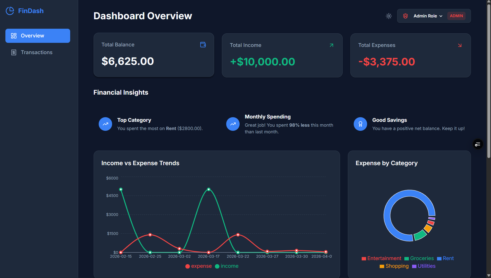

# 💰 Finance Dashboard

A clean and interactive finance dashboard built using React.
This project was developed as a frontend assignment to demonstrate UI design, state management, and data handling.

---

## 🚀 Features

### 📊 Dashboard Overview

* Summary cards for Total Balance, Income, and Expenses
* Line chart to visualize income vs expenses over time
* Pie chart showing spending distribution by category

### 💳 Transactions

* View all transactions with date, category, type, and amount
* Search and filter transactions easily
* Admin can add, edit, and delete transactions

### 👤 Role-Based UI

* Switch between **Viewer** and **Admin** roles
* Viewer → read-only access
* Admin → full control over transactions

### 💡 Insights

* Highlights highest spending category
* Shows largest expense
* Displays simple monthly comparison
* Provides quick financial observations

### ⚙️ Additional Features

* Dark mode toggle 🌙
* Data persistence using localStorage
* Export transactions as CSV
* Responsive design for different screen sizes

---

## 🛠️ Tech Stack

* React (with Context API)
* Vite
* Recharts
* Lucide React (icons)
* CSS (custom styling with variables)

---

## 📸 Screenshots





---

## 🌐 Live Demo

https://finance-dashboard-ui-app.vercel.app/

---

## ⚙️ Setup Instructions

```bash
git clone https://github.com/Mausamkumarsingh/Finance-Dashboard-UI.git
cd Finance-Dashboard-UI
npm install
npm run dev
```

---

## 🧠 Approach

This project focuses on building a simple yet effective dashboard interface without overcomplicating the architecture.

* Used **Context API** for lightweight state management
* Kept components modular and readable
* Focused on clean UI and smooth user experience
* Simulated role-based behavior on frontend

---

## 📌 Note

This is a frontend-only project built for evaluation purposes.
All data is handled using mock data and local storage.
